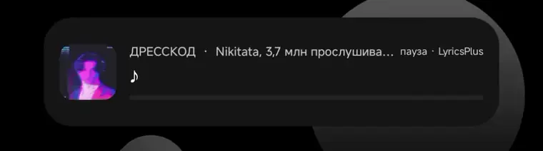

# MetroLyrics

An LSPosed module for [Metrolist](https://github.com/metrolistgroup/metrolist) that adds a lyrics widget with synchronized song lyrics.

The widget displays the current lyrics directly in the system interface, providing a smooth and unobtrusive way to follow along with the song.

## Features
- Previous, current, and next synchronized lyric lines in a resizable home-screen widget.
- Automatic word/syllable karaoke highlighting for LyricsPlus enhanced lyrics, with a plain-line fallback for regular LRC.
- Material You colors, artwork or custom-image backgrounds, album cover, progress bar, and optional line animations.

## Preview

### Karaoke demonstration
The highlight follows LyricsPlus word and syllable timestamps directly on the home screen.

  

To preview the styling without waiting for a compatible track, open **MetroLyrics** and press **Демо (Demo)**. Highlight color, unsung-text opacity, trail highlighting, bold active text, and the active-syllable pop are configurable in the **Karaoke** section.

## Requirements

- Android 14 or newer (API 34+).
- [MetroList](https://github.com/metrolistgroup/metrolist) with package name `com.metrolist.music`.
- The MetroLyrics APK from [Releases](https://github.com/hairpin01/MetroLyricsWidget/releases).

> [!IMPORTANT]
> Keep the MetroLyrics APK installed with both methods below. The APK provides the home-screen widget, while LSPosed/LSPatch loads its hook inside MetroList.

## Installation

### LSPosed (root)

1. Set up root and a working [LSPosed](https://github.com/LSPosed/LSPosed) environment. Reboot if your LSPosed installation requires it.
2. Install the official MetroList app.
3. Install the MetroLyrics APK.
4. Open **LSPosed Manager → Modules → MetroLyrics**.
5. Enable the module and set its scope to **MetroList** (`com.metrolist.music`) only.
6. Force-stop MetroList and open it again. If the module is still not loaded, reboot the device once.
7. Start playing a track, then open the launcher's widget picker and add **MetroLyrics** to the home screen.
8. Open the MetroLyrics app to configure the background, cover, lyrics, progress bar, opacity, and other widget options.

### LSPatch (no root)

LSPatch modifies MetroList itself so that it can load the MetroLyrics hook without root. [LSPatch 0.8](https://github.com/LSPosed/LSPatch/releases) supports this module through the legacy Xposed API.

> [!CAUTION]
> Always use a **clean/original MetroList APK** as the patch input. Do not patch an APK that already contains LSPatch, and do not re-patch your currently patched output.

1. Install **LSPatch Manager 0.8** from its official releases page.
2. Install the MetroLyrics APK and keep it installed.
3. Download a clean APK for the MetroList version you want to use.
4. In LSPatch Manager, open **Manage**, press **+**, and select the clean MetroList APK from storage.
5. Choose one of the patch modes:
   - **Local mode (recommended for one device):** LSPatch Manager supplies installed modules. After installing the patched MetroList, open **Modules**, enable **MetroLyrics**, and select MetroList (`com.metrolist.music`) as its scope. LSPatch Manager must remain installed.
   - **Integrated mode:** select **MetroLyrics** under **Embed modules** while creating the patch. The hook is embedded in the patched MetroList APK. The separate MetroLyrics APK must still remain installed because it owns the Android widget.
6. Keep the default patch options unless MetroList specifically reports a signature-verification problem, then create the patched APK.
7. Back up any MetroList data you need. LSPatch signs the patched APK with a different certificate, so Android normally cannot install it over the official build. Uninstall the official MetroList app, then install the newly patched APK.
8. Force-stop and reopen MetroList, play a track, and add **MetroLyrics** from the launcher's widget picker.

#### Updating a patched MetroList

Patch a new **clean** MetroList APK again using the same mode and the same LSPatch signing key. Never use the previously patched APK as input. If Android reports a signature conflict, back up MetroList data, uninstall the old patched build, and install the new one.

### Troubleshooting

- **The widget is missing:** install or reinstall the standalone MetroLyrics APK. Embedding the module into MetroList does not install the widget provider.
- **The widget stays on “Запусти MetroList” or does not receive lyrics:** the hook is not loaded. Check that MetroLyrics is enabled and scoped to `com.metrolist.music`, then fully restart MetroList.
- **“App not installed” when installing patched MetroList:** the official and patched APK signatures differ. Back up MetroList data and uninstall the existing MetroList package first.
- **Patched MetroList crashes or LSPatch appears to load twice:** start again from a clean/original MetroList APK.

## License

Licensed under MIT License

## Contributors

&nbsp;
