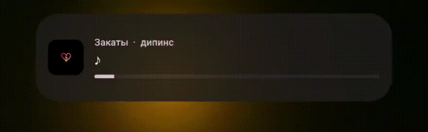

# MetroLyrics

An LSPosed module for [Metrolist](https://github.com/metrolistgroup/metrolist) that adds a lyrics widget with synchronized song lyrics.

The widget displays the current lyrics directly in the system interface, providing a smooth and unobtrusive way to follow along with the song.

## Preview

## License

Licensed under MIT License

## Contributors

&nbsp;
